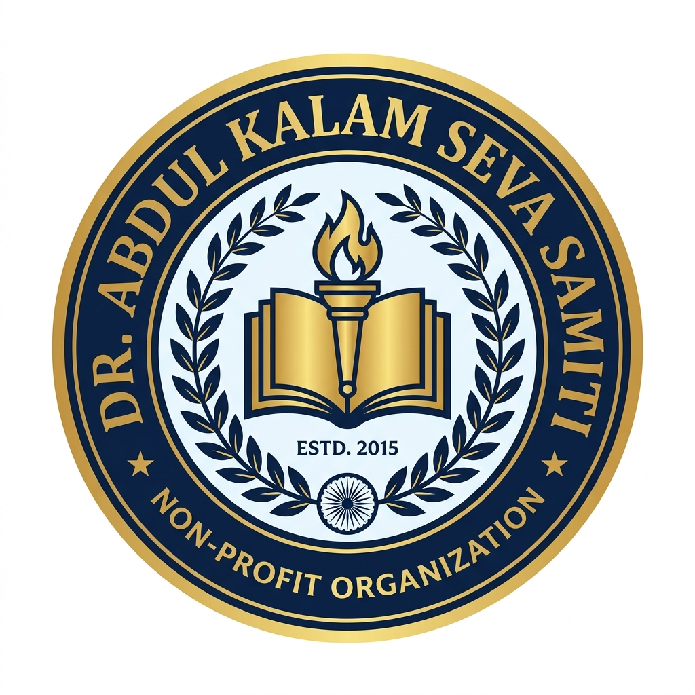

# डॉ. अब्दुल कलाम सेवा समिति (DR. ABDUL KALAM SEVA SAMITI)

उत्तर प्रदेश शासन एवं भारत सरकार के नीति आयोग दर्पण पोर्टल पर विधिवत पंजीकृत गैर-लाभकारी धर्मार्थ संस्था (NGO) की आधिकारिक वेबसाइट।



---

## 🏛️ विधिक पंजीकरण एवं आधिकारिक विवरण (Legal Credentials)

| विवरण (Parameter) | आधिकारिक साक्ष्य (Official Record) |
| :--- | :--- |
| **संस्था का नाम** | **DR. ABDUL KALAM SEVA SAMITI** (डॉक्टर अब्दुल कलाम सेवा समिति) |
| **संविधान का प्रकार** | **Society** (धर्मार्थ एवं समाज कल्याण समिति) |
| **स्थापना / पंजीकरण तिथि** | **29 जुलाई 2024 (29-Jul-2024)** |
| **स्थायी खाता संख्या (PAN)** | **AAETD8003A** |
| **नीति आयोग दर्पण पोर्टल संख्या** | **UP/2024/0464401** |
| **दर्पण पंजीकरण तिथि** | **11 नवंबर 2024 (11-Nov-2024)** |
| **आयकर विवरण (Income Tax)** | Form 10A / Section 12A(1)(ac)(vi) |
| **पंजीकृत कार्यालय पता** | **सेक्टर-ए, विजय नगर, नीलमाथा, दिलकुशा एस.ओ., कैंट, लखनऊ, उत्तर प्रदेश - 226002** |
| **आधिकारिक ईमेल** | **dakssl94@gmail.com** |
| **हेल्पलाइन नंबर** | **+91 9839113733 / +91 9769161936** |

---

## 👥 मुख्य पदाधिकारी एवं ट्रस्टी मंडल (Board of Trustees & Leadership)

1. **सबा मतीन अहमद खान (Saba Mateen Ahmad Khan)**
   - **पद:** अध्यक्ष / अधिकृत हस्ताक्षरकर्ता (President / Authorised Signatory)
   - **मोबाइल:** +91 9769161936 / +91 9839113733
   - **ईमेल:** dakssl94@gmail.com
   - **पता:** सेक्टर-ए, विजय नगर, नीलमाथा, कैंट, लखनऊ, उ०प्र० - 226002

2. **श्री हसनैन (Sri Hasnain)**
   - **पद:** सचिव / प्रबंध न्यासी (Secretary & Managing Trustee)
   - **मोबाइल:** +91 9839023095
   - **ईमेल:** hasnain20786@gmail.com
   - **पता:** लखनऊ, उत्तर प्रदेश

3. **सुश्री सना खान (Miss Sana Khan)**
   - **पद:** कोषाध्यक्ष / न्यासी (Treasurer & Key Trustee)
   - **मोबाइल:** +91 9935664964
   - **ईमेल:** Sanakhan4066@gmail.com
   - **पता:** लखनऊ, उत्तर प्रदेश

---

## 🎯 मुख्य उद्देश्य एवं सेवा कार्य (Aims & Objectives)

1. **शिक्षा प्रसार (Relief of Poverty & Education):** निर्धन बच्चों को पाठ्य सामग्री, स्कूल बैग, कॉपियां, छात्रवृत्ति एवं प्राथमिक कोचिंग सहायता।
2. **चिकित्सा राहत (Medical Relief):** नियमित निःशुल्क स्वास्थ्य परीक्षण शिविर, नेत्र जांच, औषधि वितरण एवं आपातकालीन चिकित्सा सहायता।
3. **निर्धन कल्याण (Poverty Alleviation):** ठंड के मौसम में असहायों को कंबल वितरण, अन्नदान, सूखा राशन किट एवं वस्त्र वितरण।
4. **योग, पर्यावरण व स्वावलंबन (Yoga & Women Empowerment):** सामुदायिक योग शिविर, वृक्षारोपण एवं महिलाओं को सिलाई-कढ़ाई प्रशिक्षण द्वारा आत्मनिर्भर बनाना।

---

## 🚀 गिटहब पेजेस (GitHub Pages) पर लाइव करने की विधि

यह वेबसाइट शुद्ध HTML5, आधुनिक रिस्पॉन्सिव CSS3 एवं वैनिला जावास्क्रिप्ट पर बनी है। इसे सीधे [DR_ABDUL_KALAM_SEVA_SAMITI](https://github.com/Dhirajlko/DR_ABDUL_KALAM_SEVA_SAMITI) रिपॉजिटरी पर 1 मिनट में लाइव किया जा सकता है:

### विकल्प १: Git कमांड लाइन (CLI) द्वारा
इस `website` फोल्डर के अंदर टर्मिनल खोलें और चलाएं:
```bash
git init
git add .
git commit -m "Official release of Dr. Abdul Kalam Seva Samiti website"
git branch -M main
git remote add origin https://github.com/Dhirajlko/DR_ABDUL_KALAM_SEVA_SAMITI.git
git push -u origin main --force
```

### विकल्प २: GitHub वेब ब्राउज़र द्वारा
1. अपने GitHub रिपॉजिटरी [https://github.com/Dhirajlko/DR_ABDUL_KALAM_SEVA_SAMITI](https://github.com/Dhirajlko/DR_ABDUL_KALAM_SEVA_SAMITI) पर जाएँ।
2. `Upload files` पर क्लिक करके `website/` फोल्डर की सभी फाइलें (`index.html`, `style.css`, `script.js`, `assets/`, `README.md`) ड्रैग करके अपलोड करें।
3. **Commit changes** पर क्लिक करें।
4. रिपॉजिटरी की **Settings** > **Pages** में जाएँ।
5. **Source** में `Deploy from a branch` चुनकर `main` शाखा और `/(root)` को Save कर दें।
6. 1 मिनट में वेबसाइट इंटरनेट पर लाइव हो जाएगी: `https://dhirajlko.github.io/DR_ABDUL_KALAM_SEVA_SAMITI/`

---

## 📂 प्रोजेक्ट संरचना (Directory Structure)

```
website/
│
├── index.html            # मुख्य वेब पेज (SEO, विधिक विवरण, बैंक/UPI एवं गैलरी सहित)
├── style.css             # पूर्णतः रिस्पॉन्सिव मॉडर्न CSS डिज़ाइन सिस्टम
├── script.js             # मोबाइल मेनू, कॉपी क्लिपबोर्ड, डोनेशन कैलकुलेटर व लाइटबॉक्स
├── README.md             # प्रोजेक्ट विवरण एवं परिनियोजन निर्देश
└── assets/
    └── images/
        ├── logo.jpg              # समिति का आधिकारिक प्रतीक चिह्न (Logo)
        ├── hero-education.jpg    # मुख्य शिक्षा व समाज सेवा बैनर
        ├── trustee-hasnain-*.jpg # सचिव श्री हसनैन के छायाचित्र
        ├── trustee-sana-*.jpg    # कोषाध्यक्ष सुश्री सना खान के छायाचित्र
        └── activity-*.jpg        # समाज कल्याण, वितरण एवं विधिक साक्ष्य छायाचित्र (15+)
```

---

## 📞 आधिकारिक संपर्क सूत्र
- **पंजीकृत कार्यालय:** सेक्टर-ए, विजय नगर, नीलमाथा, दिलकुशा एस.ओ., कैंट, लखनऊ, उत्तर प्रदेश - 226002
- **ईमेल:** dakssl94@gmail.com
- **अध्यक्ष हेल्पलाइन:** +91 9839113733 / +91 9769161936
- **सचिव हेल्पलाइन:** +91 9839023095
- **कोषाध्यक्ष हेल्पलाइन:** +91 9935664964
